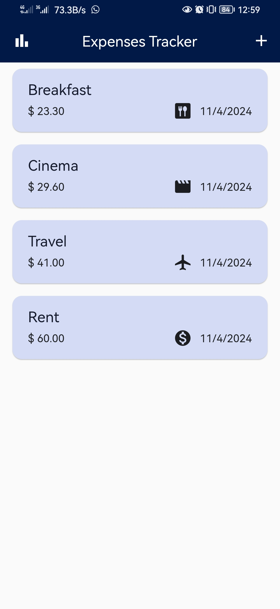
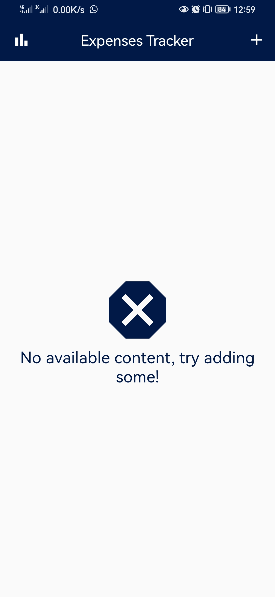
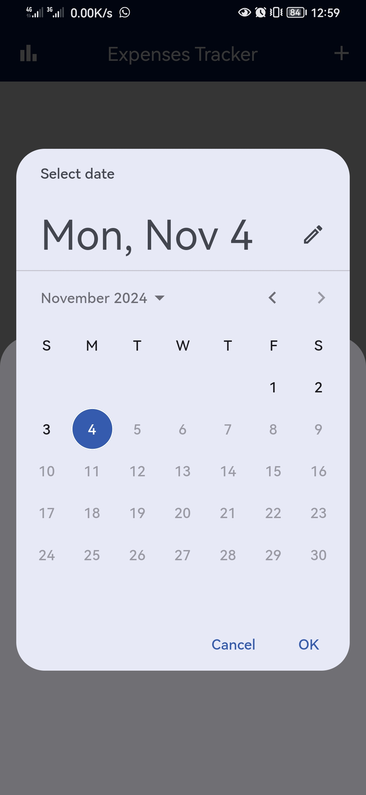
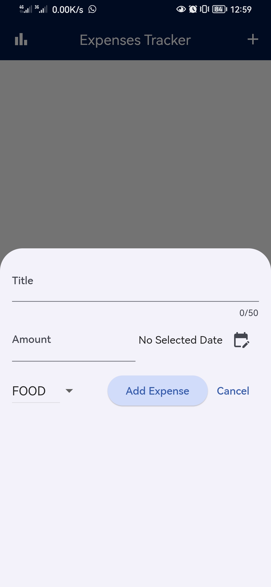
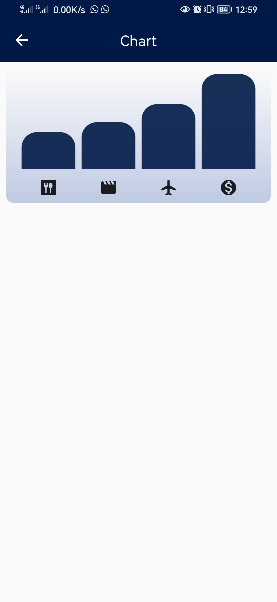

# 💰 Expenses Tracker

A beautifully designed Flutter app to help you keep track of your daily spending.

Add expenses with a simple tap, pick a category, and instantly see where your money goes through a smooth, clean UI.  
The chart gives you a quick visual of your top spending areas — no fancy libraries, just pure Flutter creativity.

---

## ✨ Features

- Add expenses using a stylish bottom modal sheet
- Category selection with a dropdown
- Clean, responsive UI across all screens
- A simple and colorful bar chart to show your spending highlights

---

## 📸 Screenshots

  
  
  
  
  

---

## 📚 Inspired by

This app was created while following a Flutter course on Udemy.  
Big thanks to the course creators for the guidance and UI inspiration.

